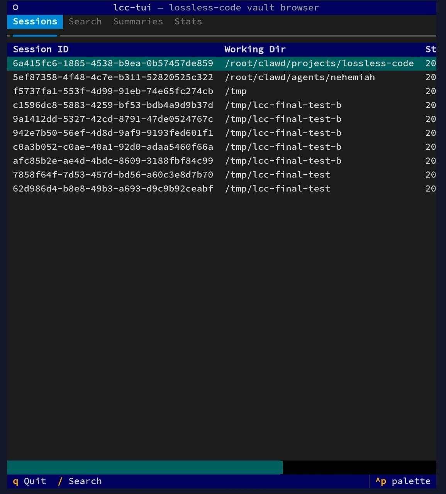

<div align="center">

# 🧠 lossless-code

**DAG-based Lossless Context Management for Claude Code.**

*Every message preserved forever. Summaries cascade, never delete. Full recall across sessions.*

[](https://opensource.org/licenses/MIT)
[](https://github.com/GodsBoy/lossless-code/stargazers)
[](https://github.com/GodsBoy/lossless-code/network/members)
[](https://github.com/GodsBoy/lossless-code/issues)
[](https://github.com/GodsBoy/lossless-code/commits/main)

[](https://www.python.org/)
[](https://www.sqlite.org/)
[](https://docs.anthropic.com/en/docs/claude-code)
[](https://modelcontextprotocol.io/)
[](https://github.com/GodsBoy/lossless-code/pulls)

[Getting Started](#install) · [MCP Server](#mcp-server) · [Commands](#commands) · [Dream](#lossless-dream) · [Terminal UI](#terminal-ui-lcc-tui) · [How It Works](#how-it-works) · [Configuration](#configuration) · [Contributing](#contributing)

</div>

---

> Claude Code forgets. claude-mem remembers fragments. lossless-code remembers everything.

## Try it in 60 seconds

```
/plugin marketplace add GodsBoy/lossless-code
/plugin install lossless-code
```

That's it. Start a new session and search your history:

> lcc_grep "database migration"

## The Problem

Claude Code forgets everything between sessions. Memory tools like ClawMem, context-memory, and claude-mem use flat retrieval: keyword search over snippets, no structure, no hierarchy, no way to trace a summary back to its source conversation.

When a project spans weeks and hundreds of sessions, flat search fails. You get fragments without lineage.

## What Makes lossless-code Different

lossless-code uses **DAG-based lossless preservation**, the same approach pioneered by [lossless-claw](https://github.com/Martian-Engineering/lossless-claw) for [OpenClaw](https://github.com/openclaw/openclaw):

- **Nothing is ever deleted.** Every message stays in `vault.db` forever.
- **Summaries form a directed acyclic graph.** Messages cascade to depth-0 summaries, which roll up to depth-1, depth-2, and beyond.
- **Full drill-down.** `lcc_expand` traces any summary back to the exact messages that created it.
- **Automatic.** Claude Code hooks capture every turn and trigger summarisation transparently. Zero manual effort.
- **Cross-session recall.** Start a new session and your full project history is immediately searchable.
- **Lossless Dream.** Extracts recurring patterns (corrections, preferences, conventions) from vault history and injects them into future sessions — like Auto-Dream but without forgetting.

```
                              ┌──────────────────┐
                              │   Claude Code     │
                              │   Session         │
                              └────────┬─────────┘
                                       │
              ┌────────────────────────┼────────────────────────┐
              │                  │                │              │
        ┌─────▼─────┐    ┌──────▼──────┐  ┌──────▼──────┐ ┌────▼─────┐
        │  Hooks     │    │   Skills    │  │   CLI       │ │  MCP     │
        │  (write)   │    │  (shell)    │  │   Tools     │ │  Server  │
        │            │    │             │  │             │ │  (stdio) │
        │ SessionStart│   │ lcc_grep    │  │ lcc_status  │ │          │
        │ Stop       │    │ lcc_expand  │  │             │ │ 6 tools  │
        │ PreCompact │    │ lcc_context │  │             │ │ read-only│
        │ PostCompact│    │ lcc_sessions│  │             │ │          │
        │ UserPrompt │    │ lcc_handoff │  │             │ │          │
        └─────┬──────┘    └──────┬──────┘  └──────┬──────┘ └────┬─────┘
              │                  │                │              │
              └──────────────────┼────────────────┼──────────────┘
                                 │                │
                        ┌────────▼────────────────▼──┐
                        │         vault.db            │
                        │         (SQLite)            │
                        │                             │
                        │  messages    summaries       │
                        │  summary_sources  sessions   │
                        │  FTS5 indexes                │
                        └──────────────────────────────┘
```

## Comparison

| | lossless-code | ClawMem | context-memory | claude-mem |
|---|---|---|---|---|
| **Storage** | SQLite with FTS5 | SQLite + vector DB | Markdown files | SQLite + Chroma |
| **Structure** | DAG (summaries cascade) | Flat RAG retrieval | Flat retrieval | Flat retrieval |
| **Drill-down** | Full (summary to source messages) | None | None | None |
| **Auto-capture** | Hooks (zero manual effort) | Hooks + watcher | Manual | Hooks + worker |
| **Cross-session** | Yes (vault persists) | Yes | Yes | Yes |
| **Summarisation** | Cascading DAG (depth-N) | Single-level | None | Single-level |
| **Search** | FTS5 full-text | Hybrid (BM25 + vector + reranker) | Keyword | Hybrid (BM25 + vector) |
| **MCP tools** | 6 | 28 | 0 | 10+ |
| **Background services** | None | watcher + embed timer + GPU servers | None | Worker on port 37777 |
| **Runtime** | Python (stdlib) | Bun + llama.cpp (optional) | None | Bun |
| **Models required** | None (optional for summarisation) | 2GB+ GGUF (embed + reranker) | None | Chroma embeddings |
| **Idle cost** | Zero | CPU/RAM for services + embedding sweeps | Zero | Worker process |

## Why lossless-code Costs Less

Memory tools that inject context on every prompt are silently expensive. Here's why lossless-code's design saves tokens:

### 1. On-demand recall, not automatic injection

ClawMem injects relevant memory into **90% of prompts automatically** (their stated design). claude-mem injects a context index on every SessionStart. Both approaches front-load tokens whether or not the agent needs that context.

lossless-code injects **nothing by default**. Context surfaces only when the agent explicitly calls an MCP tool or the PreCompact hook fires. Most coding turns (writing code, running tests, reading files) don't need historical context at all. You pay for recall only when recall matters.

### 2. Fewer MCP tool definitions = fewer tokens per turn

Every MCP tool registered in `~/.claude.json` has its schema injected into **every single API call** as available tools. Claude Code's own docs warn: *"Prefer CLI tools when available... they don't add persistent tool definitions."*

- ClawMem: **28 MCP tools** (query, intent_search, find_causal_links, timeline, similar, etc.)
- claude-mem: **10+ search endpoints** via worker service
- lossless-code: **6 MCP tools** (grep, expand, context, sessions, handoff, status)

Over a 200-turn session, that difference in tool schema overhead compounds significantly.

### 3. No background embedding costs

ClawMem runs a watcher service (re-indexes on file changes) and an embed timer (daily embedding sweep across all collections). These require GGUF models (~2GB minimum) and consume CPU/GPU continuously. claude-mem runs a persistent worker service on port 37777.

lossless-code has **zero background processes**. Hooks fire only during Claude Code events. The vault is pure SQLite with FTS5 (built into SQLite, no external models). Nothing runs between sessions.

### 4. DAG summarisation reduces compaction waste

When Claude Code hits its context limit, it compacts: summarising earlier context to make room. With flat memory systems, compaction loses fidelity and the agent may re-explore territory it forgot, costing more tokens ("debugging in circles").

lossless-code's DAG captures the full conversation **before** compaction happens (PreCompact hook). After compaction, the PostCompact hook re-injects only the top-level summaries. The agent can drill down via `lcc_expand` if it needs detail, but the DAG ensures nothing is truly lost. This means:

- Fewer repeated explorations after compaction
- One long session is cheaper than multiple short sessions covering the same ground
- Context survives compaction without paying to re-read everything

### 5. No runtime dependencies

| Dependency | lossless-code | ClawMem | claude-mem |
|---|---|---|---|
| Python 3.10+ | Yes (usually pre-installed) | No | No |
| Bun | No | **Required** | **Required** |
| llama.cpp / GGUF models | No | Optional (2GB+) | No |
| Chroma / vector DB | No | No | **Required** |
| systemd services | No | Recommended | No |
| `mcp` Python SDK | Yes (pip install) | No (TypeScript) | No |

Fewer dependencies means less to maintain, fewer failure modes, and lower resource consumption.

## Install

### Option A: Claude Code Plugin (recommended)

```
/plugin marketplace add GodsBoy/lossless-code
/plugin install lossless-code
```

Hooks, MCP server, and skill are activated automatically. No manual setup needed.

### Option B: Standalone Install

```bash
git clone https://github.com/GodsBoy/lossless-code.git
cd lossless-code
bash install.sh
```

The installer:
1. Creates `~/.lossless-code/` with `vault.db` and scripts
2. Configures Claude Code hooks in `~/.claude/settings.json`
3. Installs the skill to `~/.claude/skills/lossless-code/`
4. Adds CLI tools to PATH

Idempotent: safe to run again to upgrade.

### Requirements

- Python 3.10+
- SQLite 3.35+ (for FTS5)
- Claude Code CLI

Optional: `anthropic` Python package for AI-powered summarisation (falls back to extractive summaries without it).

## MCP Server

lossless-code includes an MCP (Model Context Protocol) server so Claude Code can access the vault as **native tools** without shelling out to CLI commands.

### Setup

The installer (`install.sh`) automatically:
1. Copies the MCP server to `~/.lossless-code/mcp/server.py`
2. Installs the `mcp` Python SDK
3. Registers the server in `~/.claude.json`

After installation, every new Claude Code session auto-discovers 6 MCP tools:

| Tool | Description |
|------|-------------|
| `lcc_grep` | Full-text search across messages and summaries |
| `lcc_expand` | Expand a summary back to source messages (DAG traversal) |
| `lcc_context` | Get relevant context for a query |
| `lcc_sessions` | List sessions with metadata |
| `lcc_handoff` | Generate session handoff documents |
| `lcc_status` | Vault statistics (sessions, messages, DAG depth, DB size) |

### Manual Registration

If you need to register the MCP server manually:

```json
// ~/.claude.json
{
  "mcpServers": {
    "lossless-code": {
      "command": "python3",
      "args": ["~/.lossless-code/mcp/server.py"]
    }
  }
}
```

### Architecture

```
  Claude Code  ──stdio──▶  MCP Server  ──read-only──▶  vault.db
                            (server.py)
                            6 tools
```

The MCP server is **read-only**. All writes to the vault happen through hooks (SessionStart, Stop, UserPromptSubmit, PreCompact, PostCompact). The MCP server imports `db.py` directly for SQLite access.

## Commands

### `lcc_grep <query>`

Full-text search across all messages and summaries.

```bash
lcc_grep "database migration"
lcc_grep "auth refactor"
```

### `lcc_expand <summary_id>`

Expand a summary node back to its source messages.

```bash
lcc_expand sum_abc123def456
lcc_expand sum_abc123def456 --full
```

### `lcc_context [query]`

Surface relevant DAG nodes for a query. Without a query, returns highest-depth summaries.

```bash
lcc_context "auth system"
lcc_context --limit 10
```

### `lcc_sessions`

List recorded sessions with timestamps and handoff status.

```bash
lcc_sessions
lcc_sessions --limit 5
```

### `lcc_handoff`

Show or generate a session handoff.

```bash
lcc_handoff
lcc_handoff --generate --session "$CLAUDE_SESSION_ID"
```

### `lcc_status`

Show vault statistics: message count, summary count, DAG depth, dream stats, and FTS index health.

```bash
lcc_status
```

### `lcc_dream`

Run the dream cycle — extract patterns from vault history and consolidate the DAG.

```bash
lcc_dream --run                    # Dream for current working directory
lcc_dream --run --project /path    # Dream for a specific project
lcc_dream --run --global           # Cross-project dream
```

See [Lossless Dream](#lossless-dream) for details.

## Terminal UI (lcc-tui)

`lcc-tui` is a terminal-based browser for your vault. Built with [Textual](https://github.com/Textualize/textual).

```bash
lcc-tui
```

### Views

| Tab | Key | Description |
|-----|-----|-------------|
| Sessions | `1` | Browse all sessions; select to view messages |
| Search | `2` | Full-text search across messages and summaries |
| Summaries | `3` | Browse DAG summaries by depth; select to expand |
| Stats | `4` | Dashboard: sessions, messages, summaries, vault size |

### Navigation

- `1` to `4`: switch tabs
- `/`: open search modal from any view
- `Enter`: drill into selected session or summary
- `Esc`: go back
- `q`: quit



Full reference: [docs/tui.md](docs/tui.md)

## How It Works

### Hooks (Automatic)

| Hook | Event | Purpose |
|------|-------|---------|
| `session_start.sh` | SessionStart | Register session, inject handoff + summaries |
| `stop.sh` | Stop | Persist each turn to vault.db; trigger auto-dream if conditions met |
| `user_prompt_submit.sh` | UserPromptSubmit | Surface relevant context for the prompt |
| `pre_compact.sh` | PreCompact | Run DAG summarisation before compaction |
| `post_compact.sh` | PostCompact | Record compaction, re-inject top summaries |

### DAG Summarisation

1. Collect unsummarised messages, chunk into groups of ~20
2. Summarise each chunk (via Claude API or extractive fallback)
3. Write summary nodes to `summaries` table (depth=0)
4. Link to sources in `summary_sources`
5. Mark source messages as summarised
6. If depth-N exceeds threshold: cascade to depth-N+1
7. Repeat until under threshold at every depth

### Lossless Dream

Dream is the intelligence layer on top of the DAG. It analyzes vault history to extract recurring patterns and consolidate redundant summaries — all without deleting anything.

**Three-phase cycle:**

1. **Pattern extraction** — Queries messages and summaries since the last dream, chunks them, and sends each chunk to the LLM. Extracts patterns in 5 categories: corrections, preferences, anti-patterns, conventions, decisions. Falls back to keyword heuristics when no LLM API is available.
2. **DAG consolidation** — Finds summaries with overlapping sources (>50% shared), merges them into tighter nodes via LLM, marks originals as `consolidated=1`. Nothing is deleted.
3. **Report generation** — Writes a timestamped report and updates the dream log for idempotent reruns.

**Auto-trigger:** Dream runs automatically from the `stop.sh` hook when configurable conditions are met (default: 5+ sessions or 24+ hours since last dream). Runs as a background process with file-based locking to prevent concurrent races.

**Context injection:** On SessionStart, per-project and global dream patterns are injected alongside existing handoff and summaries, within a configurable token budget (default 2000 tokens).

**Lineage:** Every pattern in `patterns.md` includes source reference IDs. Use `lcc_expand` to trace any pattern back to the original conversation.

```bash
# Run dream manually
lcc dream --run

# Dream for a specific project
lcc dream --run --project /path/to/project

# Cross-project dream
lcc dream --run --global
```

### Storage

```
~/.lossless-code/
  vault.db       # SQLite: all messages, summaries, DAG, sessions, dream_log
  config.json    # Settings (summary model, thresholds, dream config)
  scripts/       # Python modules and CLI tools
  hooks/         # Shell scripts called by Claude Code hooks
  dream/         # Dream output
    reports/     # Timestamped dream reports
    projects/    # Per-project pattern files (keyed by working dir hash)
    global/      # Cross-project pattern files
    dream.log    # Dream cycle log (for debugging background execution)
```

## Configuration

`~/.lossless-code/config.json`:

```json
{
  "summaryModel": "claude-haiku-4-5-20251001",
  "summaryProvider": "anthropic",
  "chunkSize": 20,
  "depthThreshold": 10,
  "incrementalMaxDepth": -1,
  "workingDirFilter": null,
  "autoDream": true,
  "dreamAfterSessions": 5,
  "dreamAfterHours": 24,
  "dreamModel": "claude-haiku-4-5-20251001",
  "dreamTokenBudget": 2000
}
```

| Key | Default | Description |
|-----|---------|-------------|
| `summaryModel` | `claude-haiku-4-5-20251001` | Model for compactions |
| `summaryProvider` | `anthropic` | LLM provider: `anthropic` or `openai` |
| `chunkSize` | `20` | Messages per compaction chunk |
| `depthThreshold` | `10` | Max nodes at any depth before cascading |
| `incrementalMaxDepth` | `-1` | Max cascade depth (-1 = unlimited) |
| `workingDirFilter` | `null` | Only capture messages from this directory |
| `autoDream` | `true` | Enable automatic dream trigger from stop hook |
| `dreamAfterSessions` | `5` | Sessions since last dream before auto-trigger |
| `dreamAfterHours` | `24` | Hours since last dream before auto-trigger |
| `dreamModel` | `claude-haiku-4-5-20251001` | Model for dream pattern extraction |
| `dreamTokenBudget` | `2000` | Max tokens for dream pattern injection on SessionStart |

## Compaction Configuration

lossless-code supports multiple LLM providers for compactions. Configure your provider in `~/.lossless-code/config.json`:

```json
{
  "summaryModel": "gpt-4.1-mini",
  "summaryProvider": "openai",
  "chunkSize": 20,
  "depthThreshold": 10
}
```

### Supported Providers

**Anthropic** (default)

Authentication is resolved automatically from multiple sources (in priority order):

1. `ANTHROPIC_API_KEY` environment variable (standard API key)
2. Claude Code OAuth token from `~/.claude/.credentials.json` (setup-token)
3. `CLAUDE_CODE_OAUTH_TOKEN` environment variable

> **Note:** OAuth/setup-tokens require `ANTHROPIC_BASE_URL` pointing to a compatible proxy (e.g. OpenClaw), since `api.anthropic.com` does not accept OAuth tokens directly. If you only have a setup-token and no proxy, use the OpenAI provider instead.

```json
{ "summaryProvider": "anthropic", "summaryModel": "claude-haiku-4-5-20251001" }
```

Model examples: `claude-haiku-4-5-20251001`, `claude-sonnet-4-20250514`

**OpenAI**

Set `OPENAI_API_KEY` in your environment.

```json
{ "summaryProvider": "openai", "summaryModel": "gpt-4.1-mini" }
```

Model examples: `gpt-4.1-mini`, `gpt-4.1-nano`, `gpt-4o-mini`

You can use any model your provider supports. These are just common choices.

### Cost Comparison

| Model | Input cost (per 1M tokens) |
|-------|---------------------------|
| `gpt-4.1-nano` | ~$0.10 |
| `gpt-4o-mini` | ~$0.15 |
| `gpt-4.1-mini` | ~$0.40 |
| `claude-haiku-4-5-20251001` | ~$0.80 |
| `claude-sonnet-4-20250514` | ~$3.00 |

### Estimated Monthly Costs

For typical compaction workloads using `gpt-4.1-mini`:

| Usage | Estimated cost |
|-------|---------------|
| Light (1-2 sessions/day) | $1-3/month |
| Moderate (3-5 sessions/day) | $3-7/month |
| Heavy (10+ sessions/day) | $7-15/month |

Compactions are triggered automatically before context compaction (PreCompact hook) and at session end (Stop hook). The extractive fallback runs automatically when no API key is configured: no hard dependency on any LLM provider.

## CLI Usage

The `lcc` CLI provides direct access to vault operations.

```bash
# Run compaction manually
lcc summarise --run

# Run compaction for a specific session
lcc summarise --run --session <session-id>

# Check vault status
lcc status

# Search all messages and summaries
lcc grep "auth refactor"

# Show handoff from last session
lcc handoff

# Generate and save a handoff for current session
lcc handoff --generate --session "$CLAUDE_SESSION_ID"

# List recent sessions
lcc sessions

# Expand a summary node
lcc expand sum_abc123def456

# Run dream cycle
lcc dream --run

# Dream for a specific project directory
lcc dream --run --project /path/to/project
```

## Schema

```sql
sessions        -- session_id, working_dir, started_at, last_active, handoff_text
messages        -- id, session_id, turn_id, role, content, tool_name, working_dir, timestamp, summarised
summaries       -- id, session_id, content, depth, token_count, created_at, consolidated
summary_sources -- summary_id, source_type, source_id
dream_log       -- id, project_hash, scope, dreamed_at, patterns_found, consolidations, sessions_analyzed, report_path
messages_fts    -- FTS5 index on messages.content
summaries_fts   -- FTS5 index on summaries.content
```

## Uninstall

```bash
rm -rf ~/.lossless-code
# Remove hooks from ~/.claude/settings.json manually
# Remove skill: rm -rf ~/.claude/skills/lossless-code
```

## Prior Art and Acknowledgements

lossless-code is a Claude Code adaptation of the **Lossless Context Management (LCM)** architecture created by [Jeff Lehman](https://github.com/jalehman) and the [Martian Engineering](https://github.com/Martian-Engineering) team. Their [lossless-claw](https://github.com/Martian-Engineering/lossless-claw) plugin for [OpenClaw](https://github.com/openclaw/openclaw) proved that DAG-based context preservation eliminates the information loss problem in long-running AI sessions. lossless-code brings that same architecture to Claude Code.

Additional references:
- [ClawMem](https://github.com/yoloshii/clawmem) by yoloshii (hooks architecture patterns)
- [Voltropy LCM paper](https://papers.voltropy.com/LCM) (theoretical foundation)

## Contributing

Contributions are welcome! Please:

1. Fork the repository
2. Create a feature branch (`git checkout -b feat/your-feature`)
3. Write tests for new functionality
4. Ensure tests pass
5. Open a pull request

## Roadmap

lossless-code currently supports **Claude Code** natively. The hook and plugin ecosystem across coding agents is converging fast, and we're tracking compatibility:

| Agent | Hook Support | MCP | Status | Notes |
|-------|-------------|-----|--------|-------|
| **Claude Code** | 20+ lifecycle events | ✅ | ✅ Supported | Full plugin with hooks, MCP, skills |
| **Copilot CLI** | Claude Code format | ✅ | 🟢 Next | Reads `hooks.json` natively; lowest adaptation effort |
| **Codex CLI** | SessionStart, Stop, UserPromptSubmit | ✅ | 🟡 Planned | Experimental hooks engine (v0.114.0+); MCP works today |
| **Gemini CLI** | BeforeTool, AfterTool, lifecycle | ✅ | 🟡 Planned | Different event names; needs thin adapter layer |
| **OpenCode** | session.compacting + plugin hooks | ✅ | 🔵 Researching | Plugin architecture differs; compacting hook maps to PreCompact |

> **MCP works everywhere today.** Any agent that supports MCP servers can already use `lcc_grep`, `lcc_expand`, `lcc_context`, `lcc_sessions`, `lcc_handoff`, and `lcc_status` for manual recall. The roadmap above tracks *automatic* capture via hooks.

Contributions welcome for any of the planned integrations.

## Star History

<a href="https://star-history.com/#GodsBoy/lossless-code&Date">
 <picture>
   <source media="(prefers-color-scheme: dark)" srcset="https://api.star-history.com/svg?repos=GodsBoy/lossless-code&type=Date&theme=dark" />
   <source media="(prefers-color-scheme: light)" srcset="https://api.star-history.com/svg?repos=GodsBoy/lossless-code&type=Date" />
   
 </picture>
</a>

## Contributors

[](https://github.com/GodsBoy)

## Licence

MIT

---

<div align="center">

**If lossless-code helps your workflow, consider giving it a ⭐**

[Report Bug](https://github.com/GodsBoy/lossless-code/issues/new?labels=bug) · [Request Feature](https://github.com/GodsBoy/lossless-code/issues/new?labels=enhancement)

</div>
